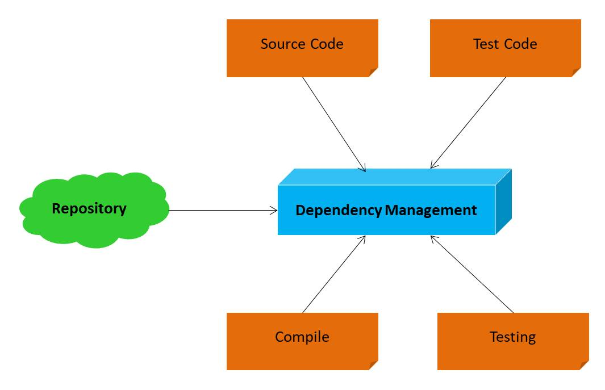

# 7th Learning Path Java : Java Apache Maven

# Agenda

- Pengenalan Build Automation
- Pengenalan Apache Maven
- Membuat Project Maven
- Maven Lifecycle
- Build Project
- Dependency Management
- Multi-Module Project
- dan lain-lain

# Pengenalan Build Automation

- Build Automation adalah proses meng-otomatisasi tahapan pembuatan software dan hal-hal yang berhubungan dengannya
- Seperti: kompilasi source code menjadi binary code, mem-package binary code menjadi distribution file, membuat dokumentasi, menjalankan automated test sampai manajemen dependency

# Kompilasi Source Code

- Berikut diagramnya:

  

# Mem-Package Binary File

- Berikut diagramnya:

  

# Membuat Dokumentasi:

- Berikut diagramnya:

  

# Menjalankan Automated Test

- Berikut diagramnya:

  

# Management Dependency

- Berikut diagramnya:

  

# Contoh Build Automation Tool

- Apache Maven
- Apache Ivy
- Gradle

# Pengenalan Apache Maven

- Apache Maven adalah salah satu build automation yang free dan open source
- Apache menggunakan XML untuk mendenisikan build script nya
- Apache Maven saat ini sangat populer di kalangan Developer Java
- Apache Maven menggunakan JVM sebagai fondasi dasar
- https://maven.apache.org/

# Teknologi yang Didukung

Apache Maven mendukung build automation untuk banyak teknologi, seperti:

- Java
- Kotlin
- Groovy
- Scala
- dan lain-lain

# Download Maven

- https://maven.apache.org/download.cgi

# Cara menginstall

- Ekstrak dulu hasil download nya
- Lalu setting path di environment variable
- Ketikan MAVEN_HOME, dan masukkan alamat path file hasil ekstrak tadi
- Lalu daftarkan di PATH dengan `%MAVEN_HOME%\bin`
- klik OK

# Membuat Project

## Archetype

- Maven mendukung pembuatan berbagai macam project dengan mudah
- Pembuatan project di maven menggunakan archetype.
- Archetype adalah `template project`
- Kita bisa menggunakan yang sudah disediakan oleh maven, atau bahkan bisa membuat template archetype sendiri

## Membuat Java Project

- `mvn archetype:generate`
- `maven-archetype-quickstart`

# Lifecycle

- Maven bekerja dalam konsep lifecycle
- Untuk menjalankan lifecycle, kita bisa menggunakan perintah : `mvn namalifecycle`
- Lifecycle akan menjalankan banyak plugin, entah bawaan maven, atau bisa kita tambahkan plugin lain jika mau

## Contoh Lifecycle

- `clean` untuk menghapus folder target (tempat menyimpan hasil kompilasi)
- `compile` untuk melakukan kompilasi source code project
- `test-compile` untuk melakukan kompilasi source code project
- `test` untuk menjalankan unit test
- `package` untuk membuat distribution file aplikasi
- `install` untuk menginstall project ke local repository, sehingga bisa digunakan di project lain di local
- `deploy` untuk men-deploy project ke remote repository di server

# Build Project

- Saat kita membuat project biasanya ada 2 jenis kode program yang kita buat, kode program nya dan kode testing nya
- Maven mendukung hal tersebut

## Menjalankan Kompilasi Program

- `mvn compile`

## Menjalankan Unit Test

- `mvn test`

## Mem-package Project

- `mvn package`

# Dependency

- Proyek aplikasi jarang sekali berdiri sendiri, biasanya membutuhkan dukungan dari pihak lain, seperti tool atau library
- Tanpa build tool seperti Apache Maven, untuk menambahkan library dari luar, kita harus melakukannya secara manual
- Apache Maven mendukung dependency management, dimana kita tidak perlu me-manage secara manual proses menambahkan dependency (tool atau library) ke dalam proyek aplikasi kita

## Dependency Scope

Saat kita menambahkan dependency ke project Maven, kita harus menentukan scope dependency tersebut, ada banyak scope yang ada di Maven. Namun sebenarnya hanya beberapa saja yang sering kita gunakan, seperti:

- `compile`, ini adalah scope default. Compile artinya dependency tersebut akan digunakan untuk build project, test project dan menjalankan project
- `test`, ini adalah scope untuk test project, hanya akan di include di bagian test project

## Mencari Dependency

- https://search.maven.org/
- https://mvnrepository.com/

# Maven Properties

- Maven mendukung properties untuk menyimpan data konfigurasi
- Fitur ini akan sangat memudahkan kita kedepannya, dibandingkan melakukan hardcode di konfigurasi maven

# Membuat Distribution File

- Secara default, maven mendukung pembuatan distribution file menggunakan lifecycle package
- Hanya saja, hasil distribution file nya berupa file `jar` yang berisikan binary code dari project kita
- Dependency lainnya tidak dimasukkan, sehingga tidak langsung dijalankan

## Menggunakan Assembly Plugin

- Salah satu plugin yang bisa kita gunakan untuk membuat distribution file beserta dependency yang kita butuhkan adalah Assembly Plugin
- Tidak hanya Assembly Plugin, sebenarnya masih banyak plugin lain yang bisa kita gunakan untuk membuat distribution file di Maven
- Untuk membuat distribution file, kita bisa menggunakan perintah `mvn package assembly:single`

# Multi Module Project

- Saat aplikasi kita sudah sangat besar, kadang ada baiknya kita buat aplikasi dalam bentuk modular
- Misal kita pisahkan module model, controller, view, service, repository, dan lain-lain
- Untungnya, Maven mendukung pembuatan project multi module

## Membuat Module Baru

- Untuk membuat module baru, di dalam project yang sudah ada, kita hanya tinggal membuat folder baru, lalu menambahkan setting pom.xml di folder tersebut
- Module harus memiliki parent, dimana parent nya adalah project diatas folder tersebut
- Selanjutnya, di parent nya pun, module harus di include

# Dependency Management

- Saat project kita sudah besar, kadang kita sering menggunakan banyak dependency
- Masalah dengan banyaknya dependency adalah jika kita salah menggunakan dependency yang sama namun versinya berbeda-beda
- Maven mendukung fitur dependency management, dimana kita bisa memasukkan daftar dependency di parent module beserta versinya, lalu menambahkan dependency tersebut di module tanpa harus menggunakan versinya
- Secara otomatis versi dependency akan sama dengan yang ada di dependency management di parent module
